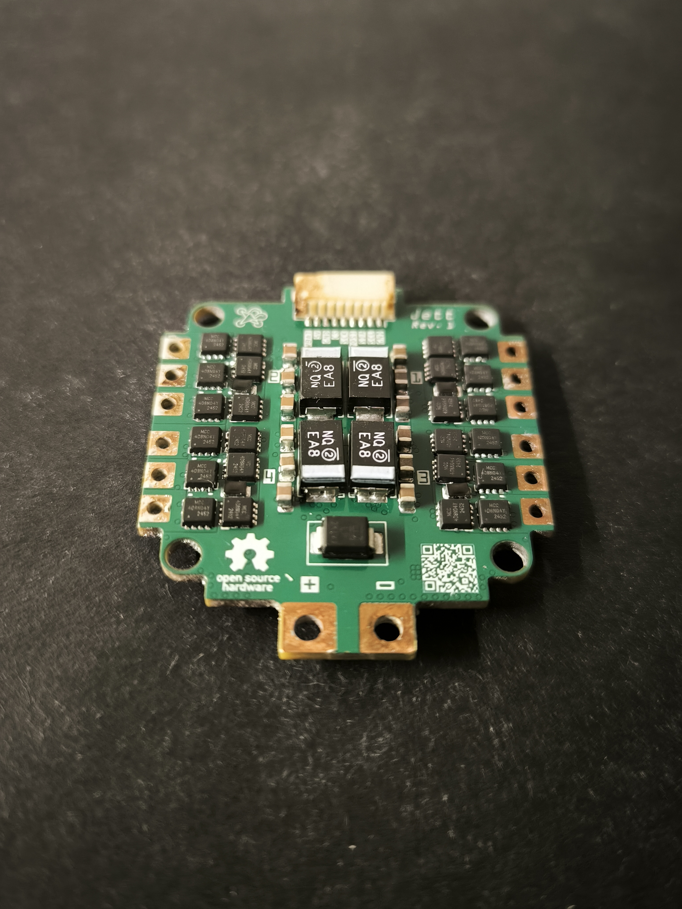
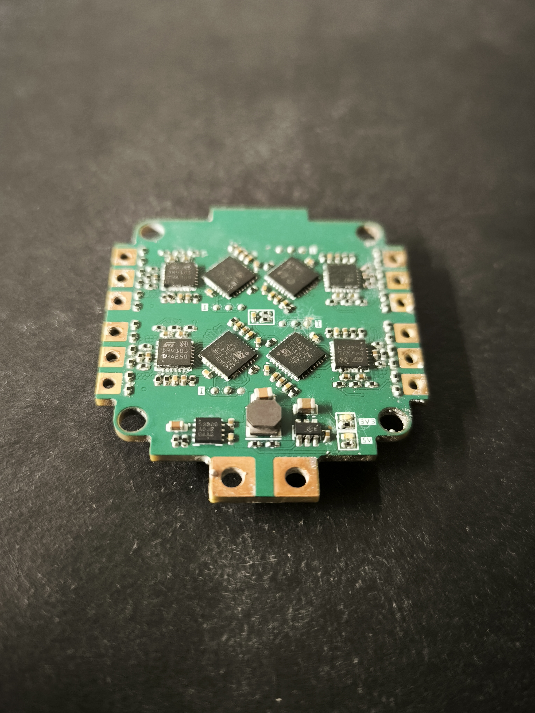

# Stratus

My take on an custom, open source yet practical drone stack.

## Jett (ESC)

  
  

**Current revision:** 1\
**Status:** Testing

### Specs

|                    |                                                    |
| ------------------ | -------------------------------------------------- |
| MCU                | STM32L431KBU6                                      |
| Gate driver        | STDRIVE101                                         |
| PWM                | 48 kHz                                             |
| Input              | 2S to 3S LiPo                                      |
| Continuous current | 12.5 A target                                      |
| Current sensing    | Low side shunt                                     |
| Throttle interface | SPI                                                |
| Telemetry          | I²C                                                |
| Capacitor bank     | 12 × 22 µF 0805 + 4 × 100 µF 2917 tantalum polymer |
| PCB                | 30.5 × 30.5 mm                                     |
| Copper             | 1 oz outer, 1 oz inner                             |

### Description

Built from the ground up to understand what is happening inside an ESC, rather than treating it as a black box. Stratus uses custom firmware with six-step/trapezoidal commutation, exposed control and telemetry buses, and hardware designed around actually being able to inspect, modify, and learn from the system.

Protection and monitoring include current sensing, fault sensing, overcurrent protection **(31.25A)**, and undervoltage protection.

**Power tree:** `VBAT → 5V buck → 3.3V low-noise LDO` (The 5V rail is also powers the FC)

## FC

**Current revision:** TBD\
**Status:** Planned

The flight controller will complete the Stratus stack, with the same focus on practical hardware and understanding the underlying system.

## License

CERN-OHL-2.0, see [LICENSE](LICENSE)
